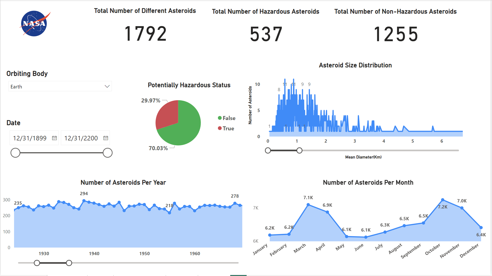

# NEO Data Pipeline

## Overview
The NEO Data Pipeline is a Python-based project that fetches Near-Earth Object (NEO) data from NASA's API, validates it, and stores it in a PostgreSQL database. The data is then visualized using Power BI to provide insights into asteroid characteristics and trends.

## Features
- Fetches NEO data from NASA's API with pagination and rate limit handling.
- Validates API responses for required fields and data consistency.
- Stores asteroid and close-approach data in a PostgreSQL database.
- Provides Power BI visualizations for data analysis.
- Logs pipeline activities for debugging and monitoring.

## Project Structure
- **`config.py`**: Contains API keys and database credentials.
- **`fetch_data.py`**: Fetches data from NASA's API with pagination and rate limit handling.
- **`database.py`**: Inserts or updates asteroid and close-approach data into the PostgreSQL database.
- **`data_checks.py`**: Validates the structure and content of the API response.
- **`logger.py`**: Configures logging for the pipeline.
- **`main.py`**: Orchestrates the entire pipeline, including fetching, validating, and storing data.
- **Power BI Dashboard**: Visualizes the stored data for analysis.

## Requirements
### Software
- Python 3.x
- PostgreSQL
- Power BI (for visualization)

### Python Libraries
- `requests`
- `pg8000`
- `logging`

Install the required libraries using:
```bash
pip install requests pg8000
```

## Database Setup
1. Create a PostgreSQL database.
2. Use the provided schema to set up the required tables:
   ```sql
   CREATE SCHEMA IF NOT EXISTS neo_data;

   CREATE TABLE IF NOT EXISTS neo_data.asteroids (
       id TEXT PRIMARY KEY,
       name TEXT,
       neo_reference_id TEXT,
       absolute_magnitude_h REAL,
       estimated_diameter_min_km REAL,
       estimated_diameter_max_km REAL,
       estimated_diameter_mean_km REAL,
       is_potentially_hazardous_asteroid BOOLEAN,
       orbit_id TEXT,
       orbit_determination_date TEXT,
       first_observation_date TEXT,
       last_observation_date TEXT,
       data_arc_in_days INTEGER,
       observations_used INTEGER,
       orbit_uncertainty TEXT,
       minimum_orbit_intersection REAL,
       jupiter_tisserand_invariant REAL,
       epoch_osculation REAL,
       eccentricity REAL,
       semi_major_axis REAL,
       inclination REAL,
       ascending_node_longitude REAL,
       orbital_period REAL,
       perihelion_distance REAL,
       perihelion_argument REAL,
       aphelion_distance REAL,
       perihelion_time REAL,
       mean_anomaly REAL,
       mean_motion REAL,
       equinox TEXT,
       orbit_class_type TEXT,
       orbit_class_description TEXT,
       orbit_class_range TEXT,
       is_sentry_object BOOLEAN
   );

   CREATE TABLE IF NOT EXISTS neo_data.close_approach_data (
       id SERIAL PRIMARY KEY,
       asteroid_id TEXT REFERENCES neo_data.asteroids(id),
       close_approach_date TEXT,
       close_approach_date_full TEXT,
       epoch_date_close_approach BIGINT,
       relative_velocity_kps REAL,
       relative_velocity_kph REAL,
       relative_velocity_mph REAL,
       miss_distance_au REAL,
       miss_distance_lunar REAL,
       miss_distance_km REAL,
       miss_distance_miles REAL,
       orbiting_body TEXT,
       UNIQUE (asteroid_id, close_approach_date)
   );
   ```

## How to Run
1. Clone the repository:
   ```bash
   git clone <repository-url>
   cd NASA_NeoWs
   ```

2. Update `config.py` with your API key and database credentials:
   ```python
   API_KEY = "your_api_key_here"
   DB_CONFIG = {
       "dbname": "your_database_name",
       "user": "your_username",
       "password": "your_password",
       "host": "your_host",
       "port": "your_port"
   }
   ```

3. Run the pipeline:
   ```bash
   python main.py
   ```

## Power BI Integration
The data stored in the PostgreSQL database is connected to Power BI for visualization. The dashboard includes:
- Total number of asteroids.
- Number of hazardous vs. non-hazardous asteroids.
- Asteroid size distribution.
- Number of asteroids per year.
- Close-approach data by orbiting body.

### Example Dashboard


### Power BI File
You can download the Power BI `.pbix` file [here](PowerBI/NASA_NeoWs.pbix).


## Logging
Logs are stored in the `logs/` directory. Key activities, such as API requests, data validation, and database operations, are logged for monitoring and debugging.

## Error Handling
- **API Rate Limits**: The pipeline handles rate limits by checking the `X-RateLimit-Remaining` header and pausing requests if necessary.
- **Empty Data**: The pipeline stops processing if the `near_earth_objects` field is empty or null.
- **Validation**: The `data_checks.py` module ensures that all required fields are present in the API response.

## Future Enhancements
- Add support for parallel processing to speed up data fetching.
- Implement a retry mechanism for database operations.
- Add more advanced visualizations in Power BI.


## Contact
For questions or feedback, please contact [dopathisharathreddy1122@example.com].